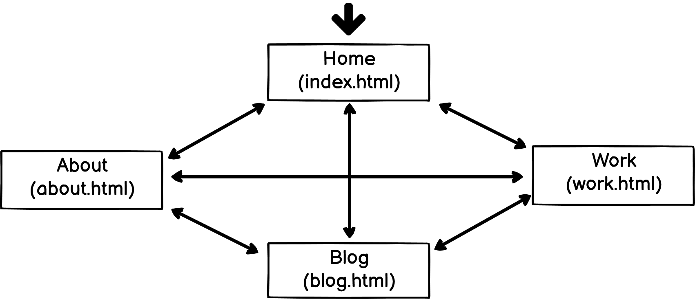

# My Portfolio Project - T1A2

[Website](https://mitchguthmann.github.io/) | [Source Code](https://github.com/MGuthmann-dev/MGuthmann-dev.github.io)

# Purpose

This page has been designed as the basis for a professional portfolio website. One that is catered to market myself as a developer and to help assist me with gaining employement in the future.

### Target Audience

- Potential Employers
- Students / Collaborators

# Function and Features

## Parallax Images

Parallax images have been utilised on each page as a visual separator between pannels. You will a great exampe of this on the page `blog.html`, where each blog post has been separated with a relevant parallax image.

## Responsive Nav Bar

Anchored to the top of each page you will find a nav bar that is responsive to screen size. For desktop this will be expanded across the top, and on mobile will shrink into the hamburger button.

# Tech Stack

- HTML
- CSS
- JS - was utilised for nav bar.

# Sitemap

As mentioned above, the site utilises a navigation bar that is anchored to the top of the page. This allows for access to all 4 pages at any time.

# Screenshots

.png>)

### The landing image on index.html

---

.png>)

### A snippit of the intro blurb, along with an example of how the parallax images works.

---

.png>)

### The footer parallax image and footer with links to LinkedIn and Github.

---

.png>)

### Landing image for about.html

---

.png>)

### About me blurb with profile picture.

---

.png>)

### Hobbies Section under the about me blurb

---

.png>)

### Landing image for blog.html

---

.png>)

### An example of a blog post, with a parallax image to separate each post

---

.png>)

### Langing image for work.html

---

.png>)

### Example section of work history, including download link to .pdf of resume

---

.png>)

### Example section to show of projects worked on.

---

---
